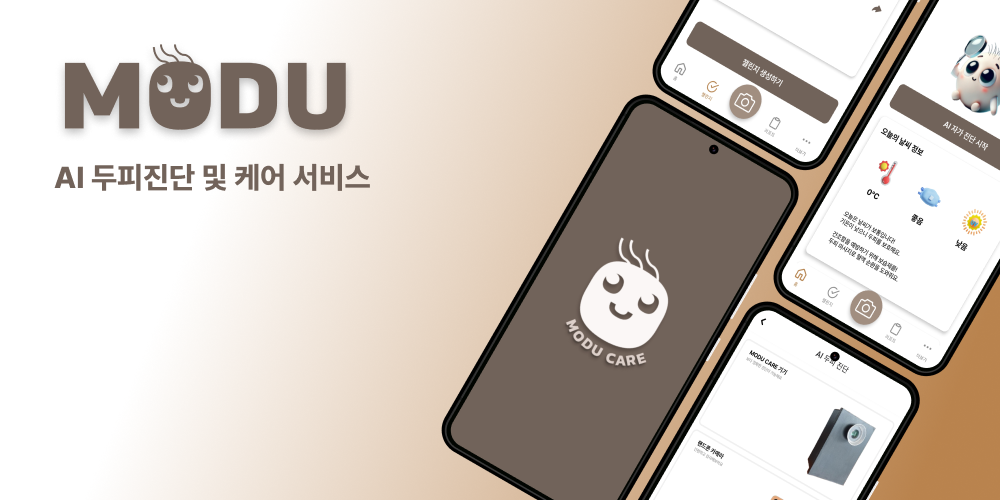
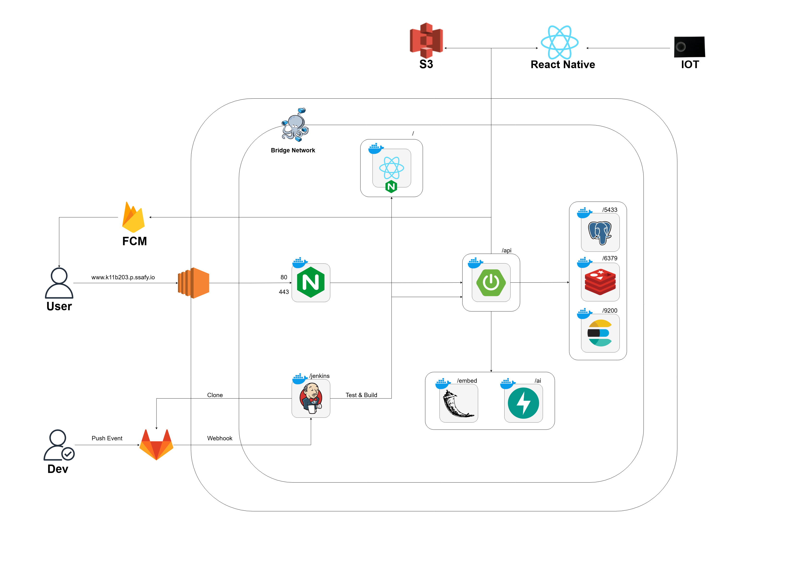
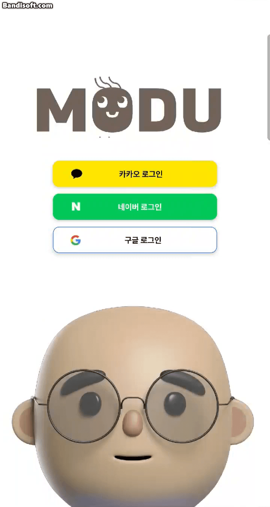
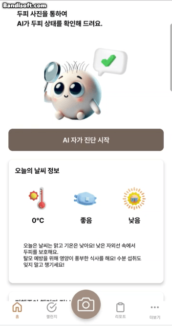
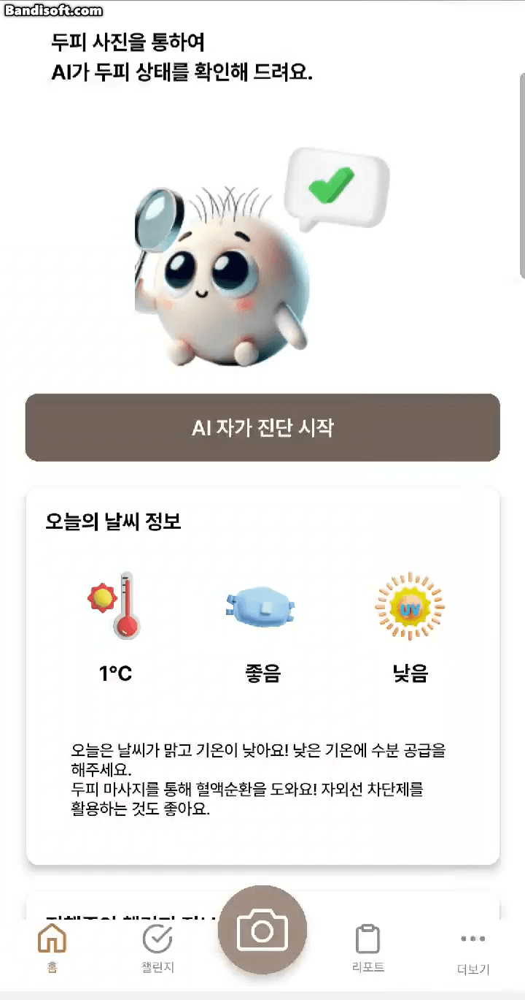
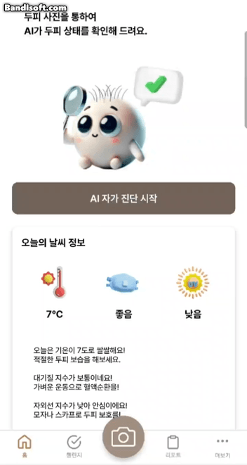
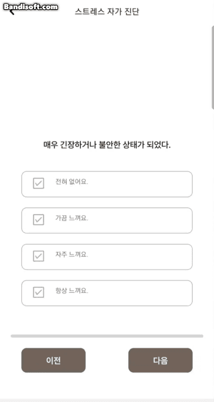
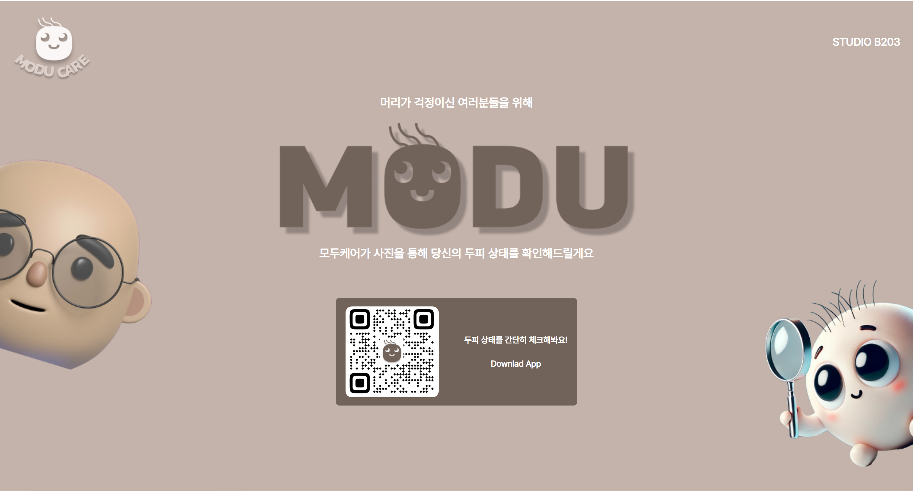

# MODU CARE 두피 탈모 케어 서비스 플랫폼

## ✍🏻 프로젝트 설명

이 프로젝트는 AI 기반 탈모 진단 및 두피 건강 케어 플랫폼으로, 탈모를 조기에 예방하고 두피 건강을 효과적으로 관리하기 위해 설계된 서비스입니다. 사용자 편의성과 개인화된 경험을 중심으로 AI 기술과 비대면 서비스 수요의 증가라는 트렌드를 반영한 실질적인 솔루션 제공 서비스입니다.

## 📅 개발기간

- 2024.10.14 ~ 2024.11.19(6주)

## 🖥 개발환경

- 배포 환경 : EC2 ubuntu(20.04.6)
- GPU 서버 : Ubuntu(20.04), Python3.9

## 🛠️ 기술스택

BackEnd   
  
   
    

FrontEnd    
   

DevOps   
  

IOT   
 

AI   

  

⚙️ Tools  
   

## 🙋🏻 팀원소개

|                  FrontEnd                  |                   FrontEnd                    |                  BackEnd                   |                  BackEnd,IoT               |                  AI                        |                  Infra                         |
| :-----------------------------------------: | :-------------------------------------------: | :----------------------------------------: | :----------------------------------------: |:----------------------------------------: |:----------------------------------------: |
|  |  |  |  |  | |
|     😎 오진영     |     😎 오승준     |     👑 박민지     |     😎 유현진     |😎 서두나     |😎 최태민     |

## 아키텍쳐 :
<!--  -->

## 주요기능

1. **두피 진단**
   - 진단
   - 맞춤형 제품 추천
   - AI, 진단 기록 문서화
2. **머리 다이어리**
3. **환경 데이터 연동**
4. **스트레스 지수 측정**
5. **루틴형 챌린지 참여**

## 프로젝트 산출물

### 로그인

- 카카오 및 네이버, 구글 소셜 로그인을 지원합니다.
- 사용자는 소셜 로그인을 통해 메인 페이지로 진입할 수 있습니다.

  

### 내 정보 수정

- 이름과 생일 정보를 입력 또는 수정할 수 있습니다.

  

### 로그아웃

- 애플리케이션을 로그아웃할 수 있습니다.

  

### 메인 화면 부가 정보 및 서비스 제공

- 오늘의 날씨, 미세먼지, 자외선 정보를 제공합니다.
- 날씨에 맞는 두피 케어 방법을 제공합니다.
- 현재 참여하고 있는 챌린지 정보 목록을 제공합니다.
- 최신 챌린지, 스트레스 진단, 최근 본 상품 등의 기능을 제공합니다.

  

### 두피 진단

- 스마트폰 또는 기기를 사용하여 두피 사진을 촬영합니다.
- AI를 통해 전달받은 두피 상태 결과를 제공합니다.
- 진단 결과 문제점 및 개선사항 안내를 제공합니다.

  

### 진단 기록 문서화

- AI 두피진단 결과를 PDF로 제공합니다.
- 사용자는 해당 데이터를 병원 진단 시 활용 할 수 있습니다.

  

### 맞춤형 제품 추천 리스트

- 진단 결과 두피 유형에 맞는 제춤 추천 리스트를 제공받습니다.
- 해당 제품 선택 시, 구매 페이지로 이동합니다.

  

### 챌린지 생성

- 이미지와 챌린지 제목을 지정하여 원하는 챌린지를 생성합니다.
- 하나의 챌린지의 제한 인원은 10명입니다.

  

### 챌린지 참여하기

- 참여하기를 눌러 챌린지에 참여합니다.
- 챌린지가 개인 루틴에 자동으로 추가됩니다.

  

### 챌린지 인증 목록 조회

- 챌린지에 참여하는 다른 유저들의 인증 목록을 조회할 수 있습니다.
- 다른 유저의 인증 피드에 좋아요을 남길 수 있습니다.

  

### 챌린지 인증 및 알림

- 매일 아침 9시 챌린지 인증 알림을 주기적으로 제공합니다.
- 하루에 한 번 챌린지 인증을 할 수 있습니다.
- 해당 챌린지에 맞는 이미지를 업로드하고 내용을 작성합니다.

  

### 머리 다이어리

- 정수리 또는 이마라인의 사진을 업로드 할 수 있는 이미지 다이어리 기능을 제공합니다.
- 이미지 캐러셀로 머리 변화를 확인 할 수 있습니다.

  

### 스트레스 자가 진단

- 스트레스 설문지를 작성하여 스트레스 진단 결과지를 제공받을 수 있습니다.
- 최근 7건 스트레스 진단 결과를 차트를 통해 확인할 수 있습니다.

  

### apk 다운로드 페이지
- https://k11b203.p.ssafy.io/ 페이지를 통해 apk를 다운받을 수 있습니다.
 
    

## 💭 프로젝트 후기

- 박민지 : 이 프로젝트는 단순히 결과물을 만드는 데 그치지 않고, 기술적 도전과 팀원들의 협력을 통해 큰 성장을 이룰 수 있었던 기회였습니다. 팀원들의 노력과 열정에 깊은 감사를 전하며, 이번 경험을 바탕으로 더 나은 서비스를 기획하고 실행할 자신감을 얻게 되었습니다. "문제를 해결하는 데 팀워크와 열린 마음이 가장 큰 자산"이라는 점을 다시금 깨달았고, 앞으로의 도전을 기대하게 된 소중한 시간이었습니다.

- 유현진 : 라즈베리파이를 활용하여 어떻게 해야 고화질의 실시간 스트리밍 통신을 할 수 있을지 많이 고민하고 연구하게 된 프로젝트였습니다. 또한 두피유무 AI 모델 데이터셋을 구축하면서 AI 모델을 어떻게 생성하는지 과정을 알 수 있게 되어 이번 프로젝트는 새로운 기술을 접하고 적용할 수 있는 기회였습니다. 이 프로젝트가 완성되기까지 많은 시행착오가 있었지만 각자의 역할을 성실히 맡아준 팀원들이 있어서 든든했습니다. 

- 오진영 : 이전 프로젝트 모두 리액트를 기반으로 웹앱 서비스를 진행했었는데 내심 리액트네이티브를 하고싶은 마음이 생겼습니다. 그래서 이번에 한번 해보자는 마음으로 처음부터 공부해서 진행했는데 아무리 리액트와 유사하다고 하지만 생소한 부분이 많이 있는 바람에 조금은 힘들기도 했습니다. 다만 프로젝트를 마무리하고 나온 산출물을 보니 뿌듯함을 많이 느꼈습니다. TanStack-Query도 많이 학습해보고 리액트와 네이티브간에 페이지 전환의 차이점과 스타일링, 빌드 방식 등 차이를 많이 배울 수 있었습니다. 다음 프로젝트에서는 더욱 고도화하여 개인적으로 앱도 출시해보고 서비스를 운영해보고 싶단 생각이 들기도 했습니다. 모두 군말없이 열심히해주셔서 너무 좋았고 고마웠습니다!

- 오승준 : 리액트 네이티브로 프로젝트를 수행하면서 팀원들에게 많이 배울 수 있는 좋은 경험이었습니다. react-native 프로젝트 구조나 util, hook 등 좀 더 가시성이 좋고 편리하게 코드를 구성했고, react-query와 zustand를 통한 상태 관리의 사이드 구분과 비동기 함수의 처리를 구현하면서 더 개인적으로 발전할 수 있었던 시간이었습니다.

- 서두나 : AI를 처음 접해 어려웠지만 모델에 관해 공부하면서 발생한 시행착오와 학습 과정에서 많이 배웠습니다. 그리고 팀원들의 도움 덕분에 완성할 수 있어서 고마웠습니다.

- 최태민 : 처음으로 인프라를 경험하며 궁금했던 배포 과정을 직접 느껴보고 배울 수 있는 기회였습니다.  처음에는 어디서부터 시작을 해야할지 고민이었지만 빌드 과정을 이해하며 구축하는 새로운 재미가 있었습니다. 

## ✅ 참고 및 출처

- AI데이터 : https://www.aihub.or.kr/aihubdata/data/view.do?currMenu=&topMenu=&aihubDataSe=data&dataSetSn=216

